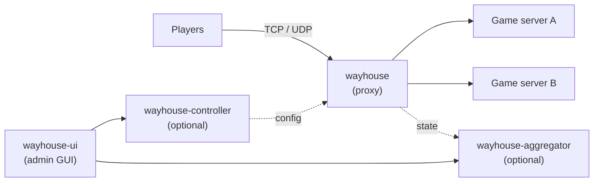

> [!CAUTION]
>
> ## 🚧 Work in progress: not finished, not production-ready 🚧
>
> This project is under active development and is **definitely not finished yet**.
>
> - The first release, `0.1.0`, exists, but the container images on GHCR are **private** for now
>   (see [Pulling private images](deploy/README.md#pulling-private-images)). The major version
>   is 0, so breaking changes land in minor versions.
> - The configuration format, CLI flags, admin/fleet HTTP APIs and on-disk formats
>   **can change at any time without notice or a migration path**.
> - Everything below is covered by automated tests, but **none of it has run in
>   production**. Parts of the deployment story (the Docker images on a developer
>   machine, the Kubernetes manifests on a real cluster) have only been exercised in CI.
>
> Feel free to read, build and experiment. Please don't put real players behind it yet.

# wayhouse

[](https://github.com/wayhouse-proxy/wayhouse/actions/workflows/ci.yml)
[](#license)

A **game-agnostic reverse proxy for game servers**, written in Rust. It is a single
entry point in front of arbitrary game servers that transparently forwards TCP and
UDP traffic to backend instances, without knowing the game's protocol.

Typical goals:

- **Hide backend IPs** so the proxy is the only DDoS-exposed point.
- **Route** by port, source address, SNI hostname or the first bytes of a connection
  to many server instances behind one public endpoint.
- **Restart without kicking players**, through connection draining.
- **Operate centrally**: Prometheus metrics, health checks, access control and an
  admin GUI for a whole fleet of proxies.

Game knowledge never lives in the core. It comes from optional, sandboxed WASM
sniffers (Minecraft virtual hosts and Source-engine A2S queries ship as
examples) or from an external routing service you control.

## Contents

- [How it fits together](#how-it-fits-together)
- [Features](#features)
- [Quick start](#quick-start)
- [Documentation](#documentation)
- [Project status](#project-status)
- [Contributing](#contributing)
- [License](#license)

## How it fits together



One `wayhouse` binary is all you need. The controller, aggregator and GUI add central
configuration and fleet-wide operation once you run more than one proxy.

## Features

<details open>
<summary><b>Data plane: TCP and UDP forwarding</b></summary>

- `round_robin`, `least_conn` and `consistent_hash` (rendezvous-hash affinity,
  `hash_on: src_ip | src_ip_port`) load balancing.
- Active `tcp_connect` / `udp_probe` health checks (`rise`/`fall` thresholds) plus
  passive connect-failure feedback; unhealthy backends are skipped.
- UDP: worker-local (lock-free) session tables, one `connect(2)` upstream socket per
  session, idle-timeout eviction (affinity: a `consistent_hash` pool) and a
  no-unsolicited-reply amplification guard.
- Linux fast paths: `splice(2)` zero-copy for TCP, `recvmmsg(2)` batching for UDP.
- Optional per-backend session caps (shared by TCP connections and UDP sessions).
- UDP `prefix:` listeners (one wildcard `IP_PKTINFO` socket serves a whole routed
  prefix) and TCP `freebind:`.

</details>

<details>
<summary><b>Routing</b></summary>

- Per-listener route rules (`routes:`, first match wins) with `always`,
  `client_cidr`, `dst`, `port`, `first_bytes` (prefix and/or length) and `sni`
  (host from the peeked, non-terminated TLS ClientHello) matchers.
- A `sniffer` matcher backed by sandboxed WASM sniffers (`wasmtime`, no WASI, no host
  imports, time and memory bounded), rescanned on every reload. First-party sniffers:
  `a2s`, `minecraft`, `quic`, `wireguard`, `openvpn`, `raknet`, `teamspeak3` and a `regex-firstbytes` template.
- External resolvers over HTTP or gRPC (`action: { resolver: <name> }`) with
  `on_error` handling and a TTL'd LRU result cache.
- Push resolver: `POST /route-hint {src_ip, pool, ttl_sec}` for short-lived
  `src_ip → pool` hints.

</details>

<details>
<summary><b>Client IP preservation</b></summary>

- PROXY protocol per pool: `v1` / `v2` for TCP, `v2-udp` on the first datagram of a
  UDP session.
- Transparent mode (`transparent: true`, Linux TPROXY) for TCP and UDP, IPv4 and IPv6:
  upstream traffic is sourced from the real client `ip:port`.

</details>

<details>
<summary><b>Security and DDoS hardening</b></summary>

- A filter chain checked before routing: per-listener `allow` / `deny` CIDR lists, an
  optional MaxMind GeoIP country filter, a token-bucket `rate_limit` per source IP and
  per /24 (v4) or /64 (v6), and `per_source` concurrency caps.
- Process-wide caps (`max_connections`, `max_udp_sessions`,
  `max_new_sessions_per_sec`).
- UDP `first_packet_gate: true` only opens a session for a positively recognised first
  datagram, keeping spoofed floods off the session table.
- `cargo-fuzz` harnesses for the packet and config parsers (`make fuzz`) and a latency
  harness for the added-latency budget (`make bench`).

</details>

<details>
<summary><b>Operations</b></summary>

- Hot reload on `SIGHUP` or config-file change: atomic snapshot swap with backend
  health carried over; listeners are added, removed or re-bound without a restart.
- Graceful shutdown that drains in-flight TCP connections and UDP sessions.
- Admin API: health/readiness, Prometheus `/metrics`, live config and session dumps,
  instance drain, backend `enabled` / `draining` / `disabled` states and runtime
  backend add/remove. Optional native TLS (`settings.admin.tls`).
- Backend discovery from `static`, `dns_srv`, `consul`, `kubernetes` and `tunnel`
  sources, reconciled live on reload.

</details>

<details>
<summary><b>Fleet control plane (optional)</b></summary>

- **`wayhouse-controller`**: versioned config store with SSE push, revision
  history/diff/rollback, staged/canary rollout, Raft HA, RBAC and audit. Proxies run
  with `wayhouse --controller <url>` instead of a local file.
- **`wayhouse-aggregator`**: fleet-wide reads (`GET /fleet/*`) and fan-out of operator
  actions to every instance.
- **`wayhouse-ui`**: admin GUI (React/Vite/TS frontend behind a dedicated BFF, so the
  browser only ever holds a session cookie).
- Regional health gossip: an authenticated SWIM mesh per `failure_domain` shares
  backend health as an advisory signal.
- Every fleet HTTP server can serve TLS itself; clients accept a custom CA
  (`--ca-file`).

</details>

<details>
<summary><b>Backend transport over WireGuard (optional)</b></summary>

- **`wayhouse-agent`** runs next to game servers that are not on a network the proxy can
  reach. It brings up WireGuard (kernel module, `boringtun` userspace fallback) and
  registers with `wayhouse-controller`, which allocates tunnel addresses from an IPv6
  (default) or IPv4 tunnel network; the WireGuard underlay may be either family.
- Proxies peer with every registered origin automatically, and a
  `backend_sources[].type: tunnel` source turns an origin into ordinary backends.
- Needs `CAP_NET_ADMIN` and `/dev/net/tun`. Origins behind CGNAT on both sides are a
  known limitation.

</details>

## Quick start

You build from source (the container images are private for now, see above). You need a Rust toolchain (the repo pins
`stable` in `rust-toolchain.toml`) and `protoc`, because the gRPC resolver client is
generated at build time (`apt install protobuf-compiler` or `brew install protobuf`).

<!-- install: filled by the rc.1 plan -->

```sh
git clone https://github.com/wayhouse-proxy/wayhouse.git
cd wayhouse

# validate the example config, then run the proxy with it
cargo run --release -p wayhouse -- --config config.example.yaml --check
cargo run --release -p wayhouse -- --config config.example.yaml
```

[`config.example.yaml`](config.example.yaml) is the annotated reference config. Copy it
and point the listeners at your own backends; the full schema is in
[docs/05-configuration.md](docs/05-configuration.md). Edit the file or send `SIGHUP`
(`kill -HUP <pid>`) to reload it without dropping connections.

The admin API listens on `127.0.0.1:9900` by default:

| Method   | Endpoints                                                                 |
| -------- | ------------------------------------------------------------------------- |
| `GET`    | `/healthz` `/readyz` `/metrics` `/pools` `/config` `/sessions`            |
| `POST`   | `/route-hint` `/admin/drain` `/admin/undrain` `/pools/{pool}/backends`    |
| `PATCH`  | `/pools/{pool}/backends/{addr}` (set `enabled` / `draining` / `disabled`) |
| `DELETE` | `/pools/{pool}/backends/{addr}`                                           |

Set the log level with `WAYHOUSE_LOG` (for example `WAYHOUSE_LOG=debug`).

Container images (six targets in one `Dockerfile`), a Docker Compose demo and plain
Kubernetes manifests live in [`deploy/`](deploy/); they are reference material, not a
supported deployment. Sniffers are described in [`docs/sniffers.md`](docs/sniffers.md).

## Documentation

> **Sniffers vs plugins.** _Sniffers_ are the WASM protocol/hostname sniffer modules; the
> official ones live in
> [`wayhouse-proxy/sniffers`](https://github.com/wayhouse-proxy/sniffers). _Plugins_ are
> integrations with other systems (e.g. the Pelican panel) and will live in
> [`wayhouse-proxy/plugins`](https://github.com/wayhouse-proxy/plugins); their design is
> still open.

The design documents in [`docs/`](docs/) are the source of truth for how the proxy is
meant to work. Start with the overview and the architecture chapter; the rest can be
read as needed. See [docs/README.md](docs/README.md) for a guided index.

| Document                                                               | Contents                                                       |
| ---------------------------------------------------------------------- | -------------------------------------------------------------- |
| [00 Overview](docs/00-overview.md)                                     | Goals, non-goals, use cases, glossary                          |
| [01 Requirements](docs/01-requirements.md)                             | Functional and non-functional requirements                     |
| [02 Architecture](docs/02-architecture.md)                             | Components, data plane / control plane, data flows             |
| [03 Routing](docs/03-routing.md)                                       | Routing strategies in detail                                   |
| [04 Transport and client IP](docs/04-transport-and-client-ip.md)       | TCP/UDP handling, client-IP preservation, PROXY protocol       |
| [05 Configuration](docs/05-configuration.md)                           | Configuration schema and examples                              |
| [06 Operations and observability](docs/06-operations-observability.md) | Metrics, logging, health checks, draining, fleet endpoints     |
| [07 Security and DDoS](docs/07-security-ddos.md)                       | Rate limiting, ACLs, DDoS mitigation                           |
| [08 Roadmap](docs/08-roadmap.md)                                       | Phased implementation and milestones                           |
| [09 Technology choices](docs/09-technology-choices.md)                 | Language, libraries, alternatives, decision records            |
| [10 Distributed control plane](docs/10-distributed-control-plane.md)   | Controller, aggregator, admin GUI, regional health             |
| [11 Backend transport](docs/11-backend-transport.md)                   | WireGuard transport for origins on other networks              |
| [12 Deployment](docs/12-deployment.md)                                 | Container images and many-port proxies under Docker/Kubernetes |

## Project status

All roadmap phases 0 to 14 are implemented and covered by `make check`: the data plane (phases 0 to 9), the distributed control
plane (10 to 13) and the WireGuard backend transport (14). "Implemented" means built
and tested, not battle-tested; see the notice at the top.

Open follow-ups, known limitations and decisions still pending live in
[`HANDOVER.md`](HANDOVER.md); per-phase detail is in
[docs/08-roadmap.md](docs/08-roadmap.md).

## Contributing

Issues and ideas are welcome. To build, test and open a pull request, read
[`CONTRIBUTING.md`](CONTRIBUTING.md). How releases are cut is in
[`RELEASING.md`](RELEASING.md). Participation is covered by the
[Code of Conduct](CODE_OF_CONDUCT.md).

For security problems, do not open a public issue; follow [`SECURITY.md`](SECURITY.md).

## License

Dual-licensed under [MIT](LICENSE-MIT) or [Apache-2.0](LICENSE-APACHE), at your option.
