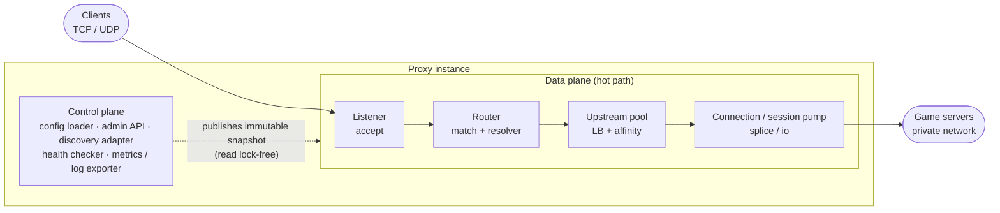

# 02 – Architecture

## Overview

## Data plane / control plane separation

- **Data plane**: accepts connections, makes the routing decision against an
  **immutable config snapshot**, pumps bytes. No lock on the hot path; snapshot swap
  via an atomic pointer swap (`arc-swap` pattern).
- **Control plane**: builds new snapshots (from file + discovery + admin API), runs
  health checks, exports metrics/logs. Runs in its own tasks/threads, may block.

A **snapshot** contains: listener definitions, the compiled routing table (including
precompiled matchers), pools with their current backend list **and** health state.
Health updates produce a new snapshot (cheap copy-on-write of the affected pool
struct, the rest is shared).

## Components

### 1. Listener
- Binds socket(s). TCP: `accept` loop or `SO_REUSEPORT` sharding across workers.
- UDP: one/more `recvmmsg` loops per socket, `SO_REUSEPORT` for scaling.
- Applies **early filters**: IP allow/deny, connection rate limit (cheap, before any
  allocation).
- Hands off to the router: for TCP after an optional peek of the first bytes; for UDP
  with the first datagram.

### 2. Router
- Selects the first matching route (deterministic priority).
- Matcher types: `always`, `sni`, `first-bytes` (prefix/regex/length), `client-cidr`,
  `dst` (destination IP/prefix), `port` (destination port), `external`.
- **Determine destination address**: with a prefix bind (one socket for a whole
  prefix), via `IP_PKTINFO`/`IPV6_RECVPKTINFO` (UDP, per datagram) or `getsockname()`
  (TCP). This is the lever for games with no protocol hint: subdomain → its own
  destination IP.
- **First-packet peek** (TCP): `MSG_PEEK` up to `peek_max_bytes` or `peek_timeout`.
  If that is not enough (the client sends nothing first), the default route applies.
- **External resolver**: calls gRPC/HTTP with `{listener, src_ip, sni, first_bytes(b64),
  routing_key}`, expects `{pool | target, sticky_key?, ttl}`. The result is cached
  (key configurable). Timeout → fallback route.
- Result: target pool + optional affinity key.

### 3. Upstream / pool
- Holds the backend list + states from the snapshot.
- The LB strategy picks a healthy backend; the affinity key is consulted first
  (consistent hashing / sticky table with TTL).
- Checks per-backend caps (max sessions, new-session rate). No candidate → defined
  error handling (TCP: RST/close; UDP: drop datagram + metric).

### 4. Connection / session pump
- **TCP**: bidirectional copy. Linux fast path via `splice()` between the two sockets
  (zero-copy), fallback to user-space buffers. Propagate half-close, timeouts (idle,
  connect), pass through `TCP_NODELAY`.
- **UDP**: one connected upstream socket per session (`connect(2)`) so replies find
  their way back without a table lookup. Session table: `HashMap<4-tuple, Session>` +
  an idle-timer timing wheel. The idle timeout closes the session.
- **PROXY protocol**: when the option is enabled, write the header before the first
  payload to the backend (TCP) or prepend it (UDP, first datagram).

### 5. Health checker (control plane)
- Active checks per backend by interval/timeout/thresholds (rise/fall).
- Passive signals from the data path (connect errors, early resets, UDP "port
  unreachable" / ICMP) feed in as events.
- Publishes a new snapshot on a state change.

### 6. Config loader & discovery adapter
- Loads/validates YAML, builds the snapshot, compiles matchers.
- Adapters (DNS SRV, Consul, K8s Endpoints, static) implement a common
  `BackendSource` interface and provide backend lists per pool.
- Reload: new snapshot becomes active atomically; listeners are reconciled by name
  (added spawned, removed stopped, changed re-spawned) — an unchanged listener
  keeps running.

### 7. Admin API
- `GET /config` (active snapshot, plaintext — implemented, phase 5), `GET /pools`,
  `GET /sessions[?listener=&pool=&proto=&src=]` (live connection / session list —
  implemented)
- `POST /admin/drain` / `POST /admin/undrain` (flip `readyz` for the LB —
  implemented, phase 5)
- `PATCH /pools/{p}/backends/{addr} {state: enabled|draining|disabled}`,
  `POST /pools/{p}/backends {addr}`, `DELETE /pools/{p}/backends/{addr}` — all
  implemented (phase 5). Add/remove edits live in a runtime overlay layered on
  the file config, so they survive a file reload.
- `POST /route-hint` – push resolver: `{src_ip, pool|target, ttl_sec}` for games with
  no protocol hint, set by launcher/matchmaker (scheme C in [03](03-routing.md))
- `POST /reload`, `GET /healthz`, `GET /readyz`, `GET /metrics`
- Auth: mTLS or bearer token, bound to an internal interface only.

## Threading / runtime model

- **One worker per CPU core**, `SO_REUSEPORT` sockets per worker → no accept
  contention.
- Each session is pinned to its accepting worker (thread-local session table → no
  locks in the UDP path).
- Control-plane tasks (health checks, reload, discovery refresh, admin API) run
  as ordinary tasks on the **same** shared multi-thread `tokio` runtime as the
  data plane, not a separate pool — simpler than the originally-planned split,
  and safe because control-plane work never blocks (rule: it may be slow, but
  never blocking-syscall slow) and never touches the hot path's locks.
- One dedicated OS thread (not a tokio task) for the sniffer plugin engine's
  epoch ticker — a `wasmtime::Engine::increment_epoch` heartbeat that arms the
  per-call timeout for WASM sniffers. Spawned once with the `SnifferLoader`, runs
  for the process lifetime, does no I/O. Absent when no `settings.sniffers` is
  configured, and absent entirely from a build without the `wasm-sniffers` cargo
  feature (which refuses a `settings.sniffers` block at startup).
- Memory: per-worker pre-reserved buffer pools; session structs from a slab allocator
  to avoid fragmentation.

## Failure & error behavior

- Backend fails during a session: TCP → close both sides, metric; UDP → the session
  stays briefly (configurable), then dropped. Optionally "rehome" new datagrams to
  another backend if no affinity is required.
- Proxy instance fails: clients reconnect; an L4 LB / anycast in front of the proxy
  spreads them onto the remaining instances. No shared session state (v1, and no
  shared *session* state in v2 either — see below).
- Overload: early rate limits + `accept` throttling + load shedding with a metric,
  before the latency of existing sessions suffers.

## Extension points

- **Sniffer plugin API**: `fn sniff(&[u8]) -> Option<RouteHint>` (SNI, Minecraft,
  Steam A2S, FiveM …). In-process (statically linked) in v1; WASM/out-of-process
  plugins later.
- **BackendSource** adapters (see above).
- **Filter chain** before routing (ACL, rate limit, geo) as an ordered, configurable
  list.

## Multi-instance & the distributed control plane (v2)

The diagram above is **one instance**. Production runs many identical, independent
instances across hosts / AZs / regions, fronted by anycast or an L4 LB; they share
nothing on the data path (ADR 4).

[10-distributed-control-plane.md](10-distributed-control-plane.md) plans the v2
additions that give a fleet operator (and a management GUI) one authoritative
config, persisted operator intent, and multi-vantage health — **without touching
the hot path**. In brief:

- **Tier 1** — a global, ordered, durable store for structural config *and*
  operator intent (the phase-5 overlay, admin state, route hints). Instances
  **pull** revisions and feed them through the same `validate() → Snapshot::build
  → ArcSwap::store` path a file reload uses. Written by a new optional
  `gsp-controller`, which also aggregates fleet reads and hosts the GUI + auth.
- **Tier 2** — a per-failure-domain gossip fabric for observed backend
  reachability. Advisory and rebuildable: each instance's own checks still
  decide, with the domain quorum as weighted input.
- **Unchanged**: the data plane, the immutable-snapshot invariant, and
  "no shared *session* state". Rate-limit buckets and UDP session tables stay
  purely instance-local.

Maps onto the predicate the data plane already computes:
`takes_new_sessions() == is_healthy() && admin_state() == Enabled` — Tier 2 feeds
the left half, Tier 1 the right.
